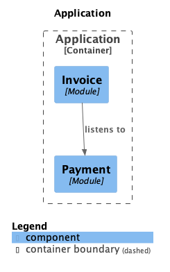
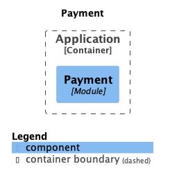
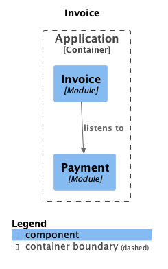

# PayFT a Spring Modulith
A Spring Modulith example.

The `dev.canm.payft.invoice.event.package-info.java` and `dev.canm.payft.payment.event.package-info.java` files export the `event` package in these modules. 

## Components
Components, payment and invoice.

## Modules
There are two modules in this example, payment and invoice.

### Payment module.

|                                                                                            |
|--------------------------------------------------------------------------------------------|
| Base package                                                                               |
| `dev.canm.payft.payment`                                                                   |
| Published events                                                                           |
| \* `d.c.p.p.PaymentReceived` created by: \*\* `d.c.p.p.internal.PaymentService.receive(…)` |

### Invoice module.

|                                                                                               |
|-----------------------------------------------------------------------------------------------|
| Base package                                                                                  |
| `dev.canm.payft.invoice`                                                                      |
| Published events                                                                              |
| \* `d.c.p.i.InvoiceIssued` created by: \*\* `d.c.p.i.internal.InvoiceService.issueInvoice(…)` |
| Events listened to                                                                            |
| \* `d.c.p.p.PaymentReceived`                                                                  |
